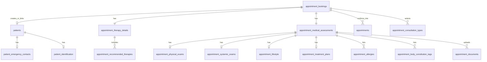

# Book Appointment — Database Schema

This document maps the **Book Appointment** popup wizard (Appointments → Book Appointment) to a relational database design. The UI is implemented as a 3-step flow:

| Step | Route | UI section |
|------|-------|------------|
| 1 | `/appointments/create-patient` | Personal Information |
| 2 | `/appointments/create-patient/step-2` | Therapy Details |
| 3 | `/appointments/create-patient/step-3` | Medical Assessment |
| Confirm | `/appointments/confirm-booking` | Review & confirm |

**Recommendation:** Use a **normalized multi-table design** (below), not one wide table. Healthcare data grows over time; splitting patient, appointment, therapy, assessment, and documents keeps queries fast and avoids nullable-column sprawl.

---

## Entity relationship (high level)



---

## 1. `appointment_bookings` (master / wizard session)

Tracks the in-progress or completed booking. One row per Book Appointment flow.

| Column | Data type | Length / precision | Nullable | Notes |
|--------|-----------|-------------------|----------|-------|
| `id` | `BIGINT` | — | NO | PK, auto-increment |
| `booking_reference` | `VARCHAR` | 30 | NO | Human-readable ref, e.g. `BK-2026-000123` |
| `patient_id` | `BIGINT` | — | YES | FK → `patients.id` (NULL until patient saved) |
| `workflow_step` | `TINYINT` | — | NO | 1 = Personal, 2 = Therapy, 3 = Medical, 4 = Confirmed |
| `booking_status` | `VARCHAR` | 20 | NO | `draft`, `submitted`, `confirmed`, `cancelled` |
| `consultation_types` | `VARCHAR` | 100 | YES | Comma-separated or use junction table (see §10) |
| `registration_date` | `DATE` | — | YES | Step 1 — Registration Date |
| `assigned_doctor_id` | `BIGINT` | — | YES | FK → `doctors.id` |
| `scheduled_date` | `DATE` | — | YES | From Step 2 — Schedule Date |
| `scheduled_time` | `TIME` | — | YES | From Step 2 — Schedule Time |
| `visit_type` | `VARCHAR` | 30 | YES | e.g. `Consultation`, `Therapy` (derived from consultation type) |
| `created_by_user_id` | `BIGINT` | — | NO | FK → `users.id` (staff who opened popup) |
| `confirmed_at` | `TIMESTAMP` | — | YES | Set on confirm popup |
| `created_at` | `TIMESTAMP` | — | NO | Default `CURRENT_TIMESTAMP` |
| `updated_at` | `TIMESTAMP` | — | NO | On update |

**Indexes:** `UNIQUE (booking_reference)`, `INDEX (patient_id)`, `INDEX (booking_status)`, `INDEX (created_by_user_id)`.

---

## 2. `patients` (Step 1 — Personal Information)

Core patient demographics and contact. Reuse this table for returning patients; link via `appointment_bookings.patient_id`.

| Column | Data type | Length / precision | Nullable | UI label |
|--------|-----------|-------------------|----------|----------|
| `id` | `BIGINT` | — | NO | PK |
| `patient_code` | `VARCHAR` | 20 | NO | Patient ID — e.g. `#PT458652`, `GAN2025-0129` |
| `secondary_code` | `VARCHAR` | 30 | YES | Secondary hospital ID if separate from display code |
| `full_name` | `VARCHAR` | 150 | NO | Full Name |
| `gender` | `VARCHAR` | 15 | YES | `Male`, `Female`, `Other`, `Prefer not to say` |
| `date_of_birth` | `DATE` | — | YES | Date of Birth |
| `age` | `SMALLINT` | — | YES | Age (0–150); prefer computed from DOB in app |
| `preferred_language` | `VARCHAR` | 50 | YES | Preferred Language |
| `mobile_number` | `VARCHAR` | 15 | NO | Mobile Number — store E.164 or `+91-XXXXXXXXXX` |
| `email` | `VARCHAR` | 254 | YES | Email Address |
| `permanent_address` | `TEXT` | — | YES | Permanent Address |
| `city` | `VARCHAR` | 100 | YES | City |
| `state` | `VARCHAR` | 100 | YES | State |
| `country` | `VARCHAR` | 50 | YES | Default `India` if not in UI |
| `pincode` | `VARCHAR` | 10 | YES | Not in UI; add if address validation needed |
| `is_active` | `BOOLEAN` | — | NO | Default `TRUE` |
| `created_at` | `TIMESTAMP` | — | NO | |
| `updated_at` | `TIMESTAMP` | — | NO | |

**Indexes:** `UNIQUE (patient_code)`, `UNIQUE (mobile_number)` (or partial unique where active), `INDEX (email)`.

---

## 3. `patient_emergency_contacts` (Step 1 — Emergency Contact)

One primary emergency contact per patient (1:1). Add `contact_order` if multiple contacts are needed later.

| Column | Data type | Length / precision | Nullable | UI label |
|--------|-----------|-------------------|----------|----------|
| `id` | `BIGINT` | — | NO | PK |
| `patient_id` | `BIGINT` | — | NO | FK → `patients.id` |
| `contact_name` | `VARCHAR` | 150 | NO | Name |
| `relation` | `VARCHAR` | 50 | YES | Relation — e.g. Spouse, Parent |
| `phone_number` | `VARCHAR` | 15 | NO | Phone Number |
| `created_at` | `TIMESTAMP` | — | NO | |
| `updated_at` | `TIMESTAMP` | — | NO | |

**Indexes:** `UNIQUE (patient_id)` for single contact model.

---

## 4. `patient_identification` (Step 1 — Identification & Admin)

| Column | Data type | Length / precision | Nullable | UI label |
|--------|-----------|-------------------|----------|----------|
| `id` | `BIGINT` | — | NO | PK |
| `patient_id` | `BIGINT` | — | NO | FK → `patients.id` |
| `id_proof_type` | `VARCHAR` | 30 | YES | ID Proof Type — Aadhaar, PAN, Passport, etc. |
| `id_number` | `VARCHAR` | 50 | YES | ID No. |
| `occupation` | `VARCHAR` | 100 | YES | Occupation |
| `insurance_details` | `VARCHAR` | 500 | YES | Insurance Details (Optional) |
| `created_at` | `TIMESTAMP` | — | NO | |
| `updated_at` | `TIMESTAMP` | — | NO | |

**Indexes:** `UNIQUE (patient_id)`.

---

## 5. `appointment_therapy_details` (Step 2 — Therapy Details)

| Column | Data type | Length / precision | Nullable | UI label |
|--------|-----------|-------------------|----------|----------|
| `id` | `BIGINT` | — | NO | PK |
| `booking_id` | `BIGINT` | — | NO | FK → `appointment_bookings.id` |
| `treatment_category` | `VARCHAR` | 100 | YES | Treatment Category |
| `session_duration_minutes` | `SMALLINT` | — | YES | Session Duration — store as minutes |
| `session_duration_label` | `VARCHAR` | 50 | YES | Raw UI value if free-text (e.g. `45 mins`) |
| `session_frequency` | `VARCHAR` | 50 | YES | Session Frequency — e.g. `Weekly`, `3x/week` |
| `assigned_therapist_id` | `BIGINT` | — | YES | FK → `staff.id` or `doctors.id` |
| `therapy_instructions` | `TEXT` | — | YES | Therapy Instructions |
| `created_at` | `TIMESTAMP` | — | NO | |
| `updated_at` | `TIMESTAMP` | — | NO | |

**Indexes:** `UNIQUE (booking_id)`.

---

## 6. `appointment_recommended_therapies` (Step 2 — multi-select)

UI allows multiple therapy chips (e.g. Therapy 1, Therapy 2).

| Column | Data type | Length / precision | Nullable | UI label |
|--------|-----------|-------------------|----------|----------|
| `id` | `BIGINT` | — | NO | PK |
| `therapy_detail_id` | `BIGINT` | — | NO | FK → `appointment_therapy_details.id` |
| `therapy_id` | `BIGINT` | — | YES | FK → `therapies.id` (master catalog) |
| `therapy_name` | `VARCHAR` | 150 | NO | Fallback if no catalog FK |
| `sort_order` | `TINYINT` | — | NO | Display order |
| `created_at` | `TIMESTAMP` | — | NO | |

**Indexes:** `INDEX (therapy_detail_id)`.

---

## 7. `appointment_medical_assessments` (Step 3 — header)

One assessment record per booking.

| Column | Data type | Length / precision | Nullable | UI label |
|--------|-----------|-------------------|----------|----------|
| `id` | `BIGINT` | — | NO | PK |
| `booking_id` | `BIGINT` | — | NO | FK → `appointment_bookings.id` |
| `dosha_type` | `VARCHAR` | 20 | YES | Dosha Type — Vata, Pitta, Kapha, Mixed |
| `current_imbalances` | `TEXT` | — | YES | Current Imbalances |
| `past_medical_conditions` | `TEXT` | — | YES | Past Medical Conditions |
| `past_surgeries` | `TEXT` | — | YES | Past Surgeries |
| `current_medications` | `TEXT` | — | YES | Current Medications |
| `family_history` | `TEXT` | — | YES | Family History |
| `created_at` | `TIMESTAMP` | — | NO | |
| `updated_at` | `TIMESTAMP` | — | NO | |

**Indexes:** `UNIQUE (booking_id)`.

---

## 8. `appointment_physical_exams` (Step 3 — Physical Examination)

| Column | Data type | Length / precision | Nullable | UI label |
|--------|-----------|-------------------|----------|----------|
| `id` | `BIGINT` | — | NO | PK |
| `assessment_id` | `BIGINT` | — | NO | FK → `appointment_medical_assessments.id` |
| `weight_kg` | `DECIMAL` | 5,2 | YES | Weight |
| `height_cm` | `DECIMAL` | 5,2 | YES | Height |
| `ibw_kg` | `DECIMAL` | 5,2 | YES | IBW (Ideal Body Weight) |
| `pulse_bpm` | `SMALLINT` | — | YES | Pulse |
| `blood_pressure` | `VARCHAR` | 20 | YES | BP — e.g. `120/80 mmHg` |
| `temperature_c` | `DECIMAL` | 4,1 | YES | Temperature |
| `pallor` | `VARCHAR` | 100 | YES | Pallor |
| `icterus` | `VARCHAR` | 100 | YES | Icterus |
| `cyanosis` | `VARCHAR` | 100 | YES | Cyanosis |
| `lymph_nodes` | `VARCHAR` | 200 | YES | Lymph Nodes |
| `oedema` | `VARCHAR` | 100 | YES | Oedema |
| `sensorium` | `VARCHAR` | 100 | YES | Sensorium |
| `acidity_gas` | `VARCHAR` | 100 | YES | Acidity / Gas |
| `motion` | `VARCHAR` | 100 | YES | Motion |
| `micturition` | `VARCHAR` | 100 | YES | Micturition |
| `created_at` | `TIMESTAMP` | — | NO | |
| `updated_at` | `TIMESTAMP` | — | NO | |

**Indexes:** `UNIQUE (assessment_id)`.

---

## 9. `appointment_systemic_exams` (Step 3 — Systemic Examination)

| Column | Data type | Length / precision | Nullable | UI label |
|--------|-----------|-------------------|----------|----------|
| `id` | `BIGINT` | — | NO | PK |
| `assessment_id` | `BIGINT` | — | NO | FK → `appointment_medical_assessments.id` |
| `cardiovascular` | `VARCHAR` | 500 | YES | Cardiovascular |
| `respiratory` | `VARCHAR` | 500 | YES | Respiratory |
| `nervous` | `VARCHAR` | 500 | YES | Nervous |
| `abdomen_gi` | `VARCHAR` | 500 | YES | Abdomen & GI |
| `locomotor` | `VARCHAR` | 500 | YES | Locomotor |
| `created_at` | `TIMESTAMP` | — | NO | |
| `updated_at` | `TIMESTAMP` | — | NO | |

**Indexes:** `UNIQUE (assessment_id)`.

---

## 10. `appointment_lifestyle` (Step 3 — Lifestyle Information)

| Column | Data type | Length / precision | Nullable | UI label |
|--------|-----------|-------------------|----------|----------|
| `id` | `BIGINT` | — | NO | PK |
| `assessment_id` | `BIGINT` | — | NO | FK → `appointment_medical_assessments.id` |
| `diet_type` | `VARCHAR` | 100 | YES | Diet Type |
| `sleep_pattern` | `VARCHAR` | 200 | YES | Sleep Pattern |
| `exercise_habits` | `VARCHAR` | 200 | YES | Exercise Habits |
| `addiction` | `VARCHAR` | 200 | YES | Addiction |
| `created_at` | `TIMESTAMP` | — | NO | |
| `updated_at` | `TIMESTAMP` | — | NO | |

**Indexes:** `UNIQUE (assessment_id)`.

---

## 11. `appointment_treatment_plans` (Step 3 — Treatment Plan)

| Column | Data type | Length / precision | Nullable | UI label |
|--------|-----------|-------------------|----------|----------|
| `id` | `BIGINT` | — | NO | PK |
| `assessment_id` | `BIGINT` | — | NO | FK → `appointment_medical_assessments.id` |
| `investigation_plan_suggested` | `TEXT` | — | YES | Investigation & Plan Suggested |
| `plan_taken` | `VARCHAR` | 500 | YES | Plan Taken |
| `created_at` | `TIMESTAMP` | — | NO | |
| `updated_at` | `TIMESTAMP` | — | NO | |

**Indexes:** `UNIQUE (assessment_id)`.

---

## 12. Junction / multi-value tables

### `appointment_consultation_types` (Step 1 — Consultation Type chips)

| Column | Data type | Length | Nullable | UI value |
|--------|-----------|--------|----------|----------|
| `id` | `BIGINT` | — | NO | PK |
| `booking_id` | `BIGINT` | — | NO | FK → `appointment_bookings.id` |
| `consultation_type` | `VARCHAR` | 30 | NO | `Consultation`, `Therapy` |

### `appointment_allergies` (Step 3 — Allergies chips)

| Column | Data type | Length | Nullable | UI value |
|--------|-----------|--------|----------|----------|
| `id` | `BIGINT` | — | NO | PK |
| `assessment_id` | `BIGINT` | — | NO | FK → `appointment_medical_assessments.id` |
| `allergy_name` | `VARCHAR` | 150 | NO | e.g. Allergy 1, Allergy 2 |

### `appointment_body_constitution_tags` (Step 3 — Body Constitution chips)

| Column | Data type | Length | Nullable | UI value |
|--------|-----------|--------|----------|----------|
| `id` | `BIGINT` | — | NO | PK |
| `assessment_id` | `BIGINT` | — | NO | FK |
| `tag_name` | `VARCHAR` | 100 | NO | e.g. Lean, Dry Skin |

---

## 13. `appointment_documents` (Step 3 — Upload Reports)

| Column | Data type | Length / precision | Nullable | UI label |
|--------|-----------|-------------------|----------|----------|
| `id` | `BIGINT` | — | NO | PK |
| `assessment_id` | `BIGINT` | — | NO | FK → `appointment_medical_assessments.id` |
| `file_name` | `VARCHAR` | 255 | NO | Original filename |
| `file_path` | `VARCHAR` | 500 | NO | Storage URL / object key |
| `file_size_bytes` | `BIGINT` | — | NO | e.g. 604KB → 618496 |
| `mime_type` | `VARCHAR` | 100 | NO | `image/jpeg`, `application/pdf` |
| `document_category` | `VARCHAR` | 50 | YES | `medical_report`, `prescription`, `lab_report` |
| `uploaded_by_user_id` | `BIGINT` | — | NO | FK → `users.id` |
| `uploaded_at` | `TIMESTAMP` | — | NO | |

**Constraints:** UI supports `.jpg`, `.jpeg`, `.png` (and PDF in list UI). Enforce via app or `CHECK (mime_type IN (...))`.

---

## 14. `appointments` (confirmed appointment — post popup)

Created when user confirms on `/appointments/confirm-booking`. Powers the appointments list grid.

| Column | Data type | Length / precision | Nullable | UI / list column |
|--------|-----------|-------------------|----------|------------------|
| `id` | `BIGINT` | — | NO | PK |
| `booking_id` | `BIGINT` | — | NO | FK → `appointment_bookings.id` |
| `patient_id` | `BIGINT` | — | NO | FK → `patients.id` |
| `doctor_id` | `BIGINT` | — | YES | Assigned Doctor |
| `appointment_date` | `DATE` | — | NO | Schedule Date |
| `appointment_time` | `TIME` | — | NO | Schedule Time |
| `visit_type` | `VARCHAR` | 30 | NO | Consultation / Therapy |
| `status` | `VARCHAR` | 30 | NO | Scheduled, Completed, Cancelled, No-show |
| `dosha` | `VARCHAR` | 20 | YES | From assessment |
| `notes` | `TEXT` | — | YES | Internal notes |
| `created_at` | `TIMESTAMP` | — | NO | Date Created (list) |
| `updated_at` | `TIMESTAMP` | — | NO | |

**Indexes:** `INDEX (patient_id)`, `INDEX (doctor_id)`, `INDEX (appointment_date, appointment_time)`, `INDEX (status)`.

---

## Save flow (recommended)

```text
Step 1 Next  → UPSERT patients, patient_emergency_contacts, patient_identification
              → UPDATE appointment_bookings (step=2, doctor, registration_date, consultation_types)

Step 2 Next  → UPSERT appointment_therapy_details + appointment_recommended_therapies
              → UPDATE appointment_bookings (scheduled_date, scheduled_time, step=3)

Step 3 Confirm → UPSERT assessment + physical/systemic/lifestyle/treatment_plan
              → INSERT allergies, body_constitution_tags, documents
              → INSERT appointments
              → UPDATE appointment_bookings (status=confirmed, confirmed_at)
```

Use a **DB transaction** on final confirm so partial data is never left in an inconsistent state.

---

## Alternative: single draft table (wizard autosave only)

If you need one table for **in-progress form autosave** before normalization:

### `book_appointment_drafts`

| Column | Data type | Length | Notes |
|--------|-----------|--------|-------|
| `id` | `BIGINT` | — | PK |
| `session_token` | `VARCHAR` | 64 | Browser session / user draft id |
| `workflow_step` | `TINYINT` | — | 1–3 |
| `form_json` | `JSON` | — | Entire wizard payload |
| `created_by_user_id` | `BIGINT` | — | |
| `expires_at` | `TIMESTAMP` | — | TTL for drafts |
| `created_at` | `TIMESTAMP` | — | |
| `updated_at` | `TIMESTAMP` | — | |

On **Confirm**, parse `form_json` and insert into the normalized tables above, then delete the draft row. Do **not** use this as the long-term store for patient/medical data.

---

## Sample DDL (PostgreSQL)

```sql
CREATE TABLE appointment_bookings (
    id                  BIGSERIAL PRIMARY KEY,
    booking_reference   VARCHAR(30)  NOT NULL UNIQUE,
    patient_id          BIGINT,
    workflow_step       SMALLINT     NOT NULL DEFAULT 1,
    booking_status      VARCHAR(20)  NOT NULL DEFAULT 'draft',
    registration_date   DATE,
    assigned_doctor_id  BIGINT,
    scheduled_date      DATE,
    scheduled_time      TIME,
    visit_type          VARCHAR(30),
    created_by_user_id  BIGINT       NOT NULL,
    confirmed_at        TIMESTAMP,
    created_at          TIMESTAMP    NOT NULL DEFAULT CURRENT_TIMESTAMP,
    updated_at          TIMESTAMP    NOT NULL DEFAULT CURRENT_TIMESTAMP
);

CREATE TABLE patients (
    id                  BIGSERIAL PRIMARY KEY,
    patient_code        VARCHAR(20)  NOT NULL UNIQUE,
    secondary_code      VARCHAR(30),
    full_name           VARCHAR(150) NOT NULL,
    gender              VARCHAR(15),
    date_of_birth       DATE,
    age                 SMALLINT,
    preferred_language  VARCHAR(50),
    mobile_number       VARCHAR(15)  NOT NULL,
    email               VARCHAR(254),
    permanent_address   TEXT,
    city                VARCHAR(100),
    state               VARCHAR(100),
    country             VARCHAR(50)  DEFAULT 'India',
    pincode             VARCHAR(10),
    is_active           BOOLEAN      NOT NULL DEFAULT TRUE,
    created_at          TIMESTAMP    NOT NULL DEFAULT CURRENT_TIMESTAMP,
    updated_at          TIMESTAMP    NOT NULL DEFAULT CURRENT_TIMESTAMP
);

-- Add remaining tables following the same pattern...
```

For **MySQL 8+**, replace `BIGSERIAL` with `BIGINT AUTO_INCREMENT`, `TIMESTAMP` with `DATETIME(3)` if sub-second precision is needed, and use `JSON` type for the draft table.

---

## Field count summary

| UI step | Tables | Approx. fields |
|---------|--------|----------------|
| Personal Information | `patients`, `patient_emergency_contacts`, `patient_identification`, `appointment_consultation_types` | 25+ |
| Therapy Details | `appointment_therapy_details`, `appointment_recommended_therapies` | 8+ |
| Medical Assessment | `appointment_medical_assessments`, physical/systemic/lifestyle/treatment + junctions | 45+ |
| Documents | `appointment_documents` | 7 per file |
| Confirmed record | `appointments` | 10+ |

**Total:** ~14 tables, ~95+ columns (excluding junction rows and document repeats).

---

## Notes for implementation

1. **Master data:** `doctors`, `therapists`, `therapies`, `treatment_categories`, `states`, `cities` should be separate lookup tables; store IDs in FK columns instead of free text where the UI uses dropdowns.
2. **PII / compliance:** Encrypt or mask `id_number`, `mobile_number`, and `email` at rest if required by policy; log access to medical assessment tables.
3. **Age vs DOB:** Store `date_of_birth` as source of truth; compute `age` in the application layer.
4. **Vitals units:** Document units in API contracts (kg, cm, °C, mmHg) to avoid ambiguity.
5. **UI source files:** `BookAppointmentStep1Page.tsx`, `BookAppointmentStep2Page.tsx`, `BookAppointmentStep3Page.tsx`, `ConfirmBookingPopupPage.tsx`.
